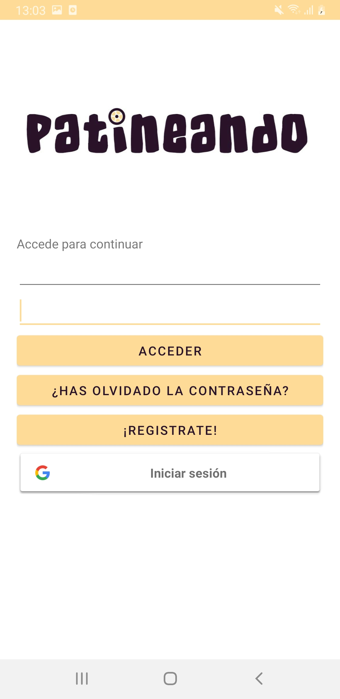
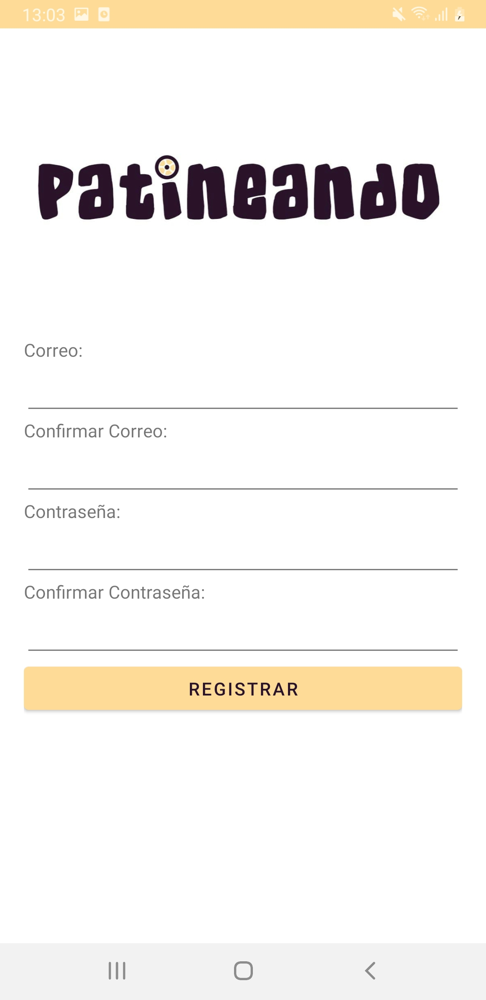
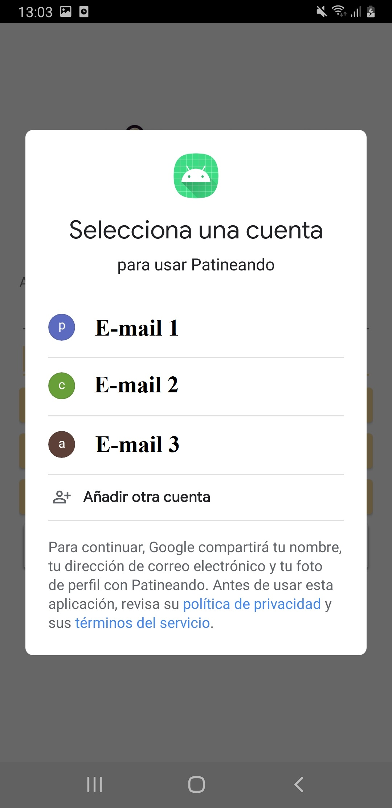
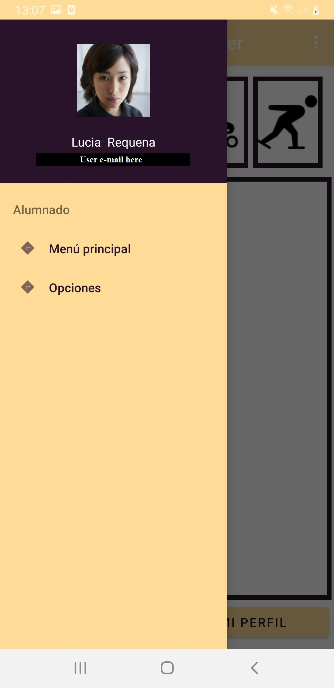
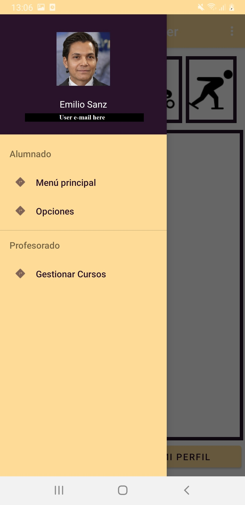
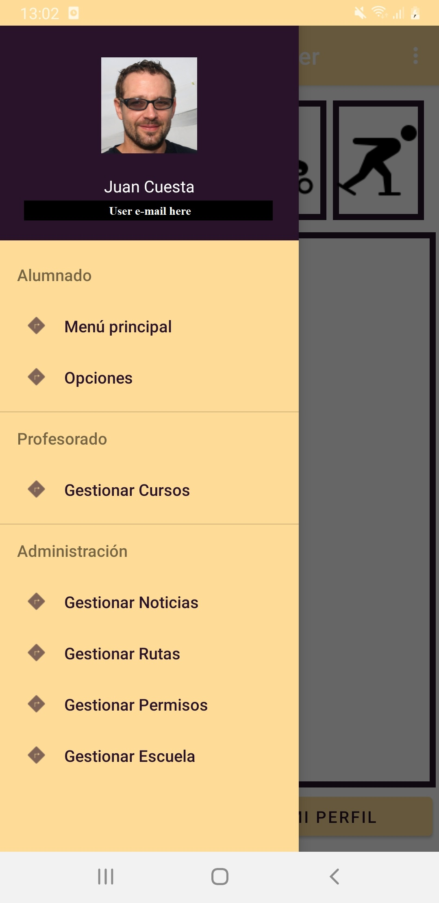
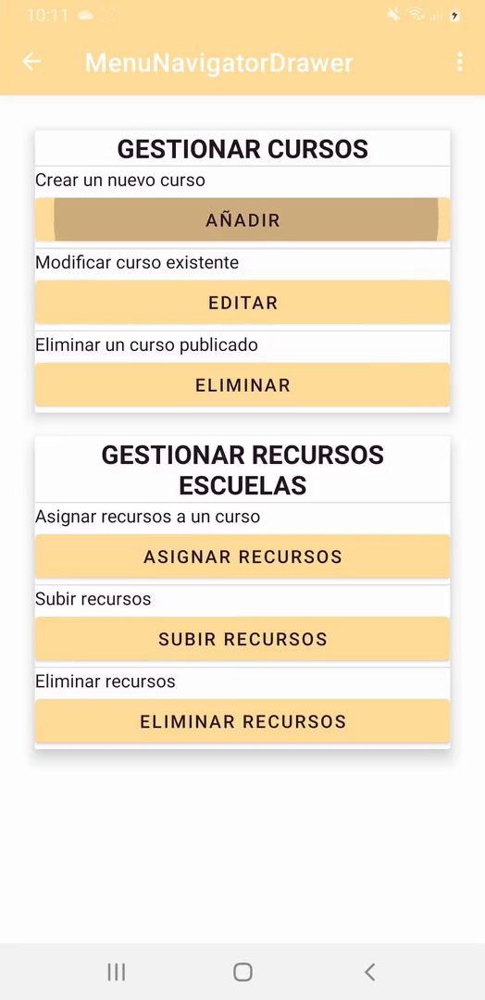
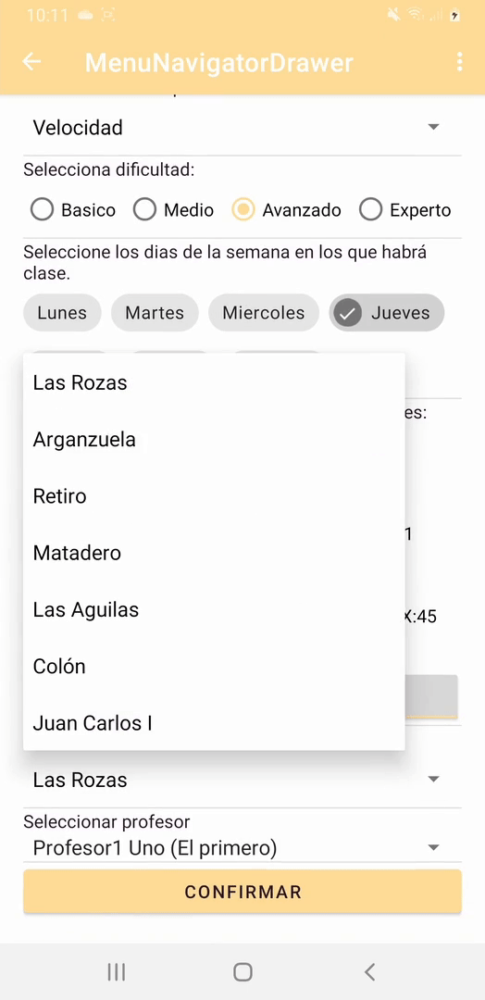
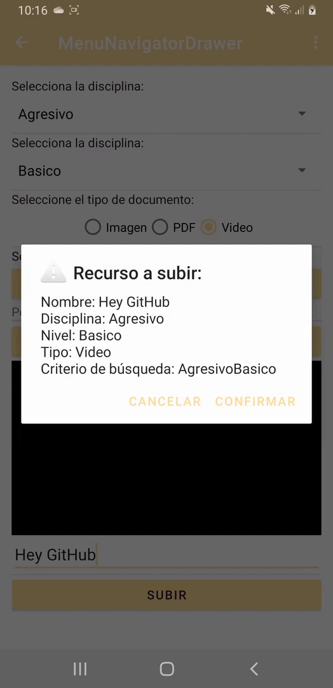

# Patineando

## 🔑 Keywords
- AndroidStudio
- Java
- Firebase
- Exoplayer
- Glide
 
## 📋 Introduction
**Patineando** is an app that emulates the dynamic management of a skating school. The students can join various courses, watch the resources in each course, check the weather, etc. 

## 🧠 Why did I make this App? The idea
I was a student in a developer course for unemployed people. We had to make a project in a month. I wanted to create a complex app as a challenge. The main requirements where: 
  1) To use a database in the cloud in order to create an immediate management of the users, resources, ...
  2) Implement a dynamic MenuNavigatorDrawer depending  on the user  access permission level.
  3) Video based resources can be uploaded to the courses based on skating technique and level. 
  4) Make the images, resources and so on from scratch. 
  5) Extra: wheather tab, user profile management and so much more. 

I love inline skating, so I decided to create this app to a fictional inline skating school. Where the administration can manage the users, the resources, the courses and so on. The resources are mostly videos which perfectly match with a skating school.

  

## ⌨ Technologies
**PiensaJuegos** is an Android Native app developed in Java using AndroidStudio. About the database, **PiensaJuegos** only has a remote non-relational database, Realtime Database by Firebase. All the resources, such as images, videos and so on are stored in the **Firebase Storage**. In order to use good practices, this app follows the MVC model as much as possible.

## 🛠 Functionality 
In this section, some of the app key parts are going to be explained.
- **Sign up & Sign in**:  
After the loading screen, the authentication window is shown.

  

 In order to use the app, the users needs to register either from scratch or using Google Sign in. 

  
 

- **Dynamic NavigatorDrawer Menu**:
Once a user has signed in, the type of user is fetched from the database in order to build a dynamic navigator drawer menu.
<i>Note: the user images used for the demo has been taken from [ThisPersonDoesNotExit](https://this-person-does-not-exist.com/en) </i>

  
  
  

- **Create a course**
In order to create a new course, some information must be provided. Aiming to minimize user input errors and test different  ways of adding data, several elements have been used in the "Create course" form. 

 
| Element       | Use / action            |
| ------------- | ------------------------------ |
| [Spinner](https://developer.android.com/guide/topics/ui/controls/spinner)     | Select type of course       |
| [RadioGroup](https://developer.android.com/reference/kotlin/android/widget/RadioGroup?hl=en)   | Select difficulty level     |
| [Chips](https://material.io/components/chips/android#using-chips)     | Select day of the week       |
| [Associated RadioGroups](https://developer.android.com/reference/kotlin/android/widget/RadioGroup?hl=en)   | Select hour     |
| [RadioGroup](https://developer.android.com/reference/kotlin/android/widget/RadioGroup?hl=en)     | Select minute       |
| [Toggle Button](https://developer.android.com/guide/topics/ui/controls/togglebutton)   | Select am/pm     |
| [Spinner](https://developer.android.com/guide/topics/ui/controls/spinner)     | Select location       |
| [Spinner](https://developer.android.com/guide/topics/ui/controls/spinner)     | Select teacher       |

  
  

- **Upload resources**
As a way of increasing the learning experience, some resources related to the course can be updated by the admins. The resources are mainly videos. Once a video has been preselected, it is displayed in a [VideoView](https://developer.android.com/reference/android/widget/VideoView). Once all the fields are filled and the user clicks on upload(<i>"Subir"</i>), an alert dialog is shown. This alert warns the user about how the key data is going to be stored. This way users will be able to  locate where the video is stored which is important due to the non relational nature of the database. As soon as the user press confirm, the upload begins. During this process a [ProgressBar](https://developer.android.com/reference/android/widget/ProgressBar) informs the user that the process is still running. When it does finish, a toast displays a message indicating if it was successful, or not.

 
 

- **Watch resources**:
Users can watch the videos associated with their subscribed courses. These videos retrieved from the database are displayed in an [ExoPlayer](https://developer.android.com/guide/topics/media/exoplayer) instance.

 

